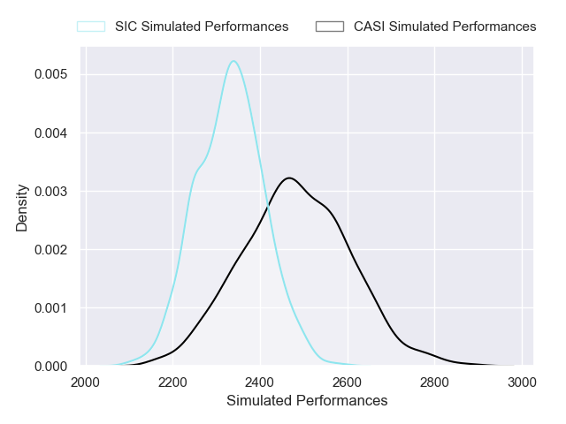
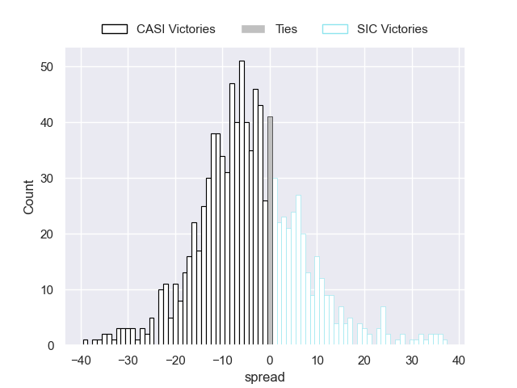
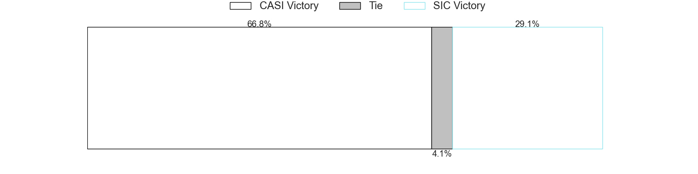

---  
layout: page  
title: CASI V SIC on 2025/09/13  
date: 2025-09-13  
categories: "URBA Top 13 2025" match projection  
---
# CASI V SIC on 2025/09/13, 33.0 to 29.0

# Club Level Predictions

Now that the game has been played, lets see how the club predictions did. I predicted CASI to win by 2.68, and CASI won by 4.0. That's an absolute error of 1.3 for the margin of victory, while my average absolute error has been 14.5 over the past six months. This prediction was more accurate than 93.3% of my recent predictions.

For the Over/Under model, I predicted a total of 52.5 and we have an actual total of 62.0. That's an absolute error of 9.5 compared to a six month average of 13.6. This prediction was more accurate than 57.1% of my recent predictions.
## Projected Performances - Club Model

## Projected Spreads - Club Model

## Projected Results - Club Model

