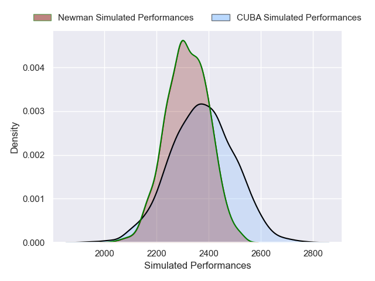
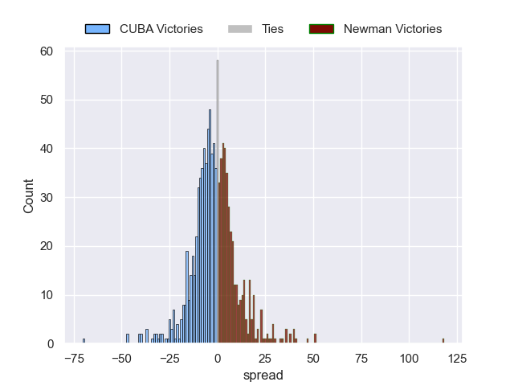

---  
layout: page  
title: CUBA V Newman on 2025/09/13  
date: 2025-09-13  
categories: "URBA Top 13 2025" match projection  
---
# CUBA V Newman on 2025/09/13, 36.0 to 39.0

# Club Level Predictions

Now that the game has been played, lets see how the club predictions did. I predicted Newman to win by 0.44, and Newman won by 3.0. That's an absolute error of 2.6 for the margin of victory, while my average absolute error has been 14.5 over the past six months. This prediction was more accurate than 87.9% of my recent predictions.

For the Over/Under model, I predicted a total of 52.5 and we have an actual total of 75.0. That's an absolute error of 22.5 compared to a six month average of 13.6. This prediction was more accurate than 18.9% of my recent predictions.
## Projected Performances - Club Model

## Projected Spreads - Club Model

## Projected Results - Club Model

