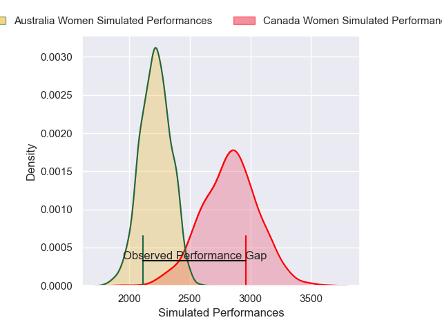
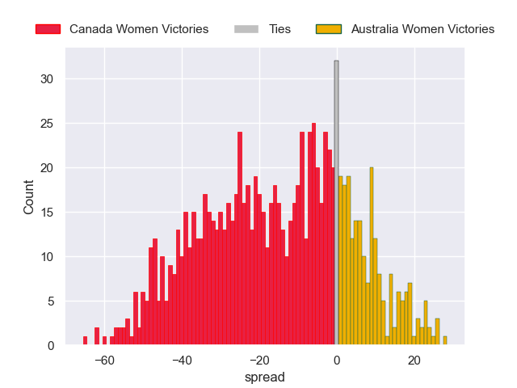

---  
layout: page  
title: Canada Women V Australia Women on 2025/09/13  
date: 2025-09-13  
categories: "Women's Rugby World Cup 2025" match projection  
---
# Canada Women V Australia Women on 2025/09/13, 46.0 to 5.0

# Club Level Predictions

Now that the game has been played, lets see how the club predictions did. I predicted Canada Women to win by 15.9, and Canada Women won by 41.0. That's an absolute error of 25.1 for the margin of victory, while my average absolute error has been 14.5 over the past six months. This prediction was more accurate than 16.1% of my recent predictions.

For the Over/Under model, I predicted a total of 61.5 and we have an actual total of 51.0. That's an absolute error of 10.5 compared to a six month average of 13.6. This prediction was more accurate than 52.2% of my recent predictions.
## Projected Performances - Club Model

## Projected Spreads - Club Model

## Projected Results - Club Model

