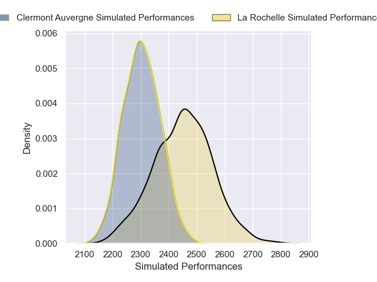
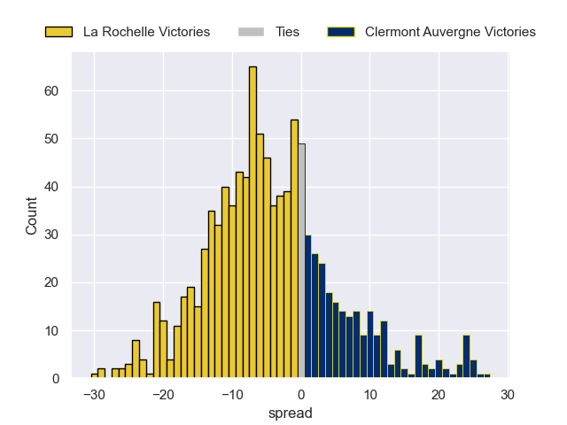
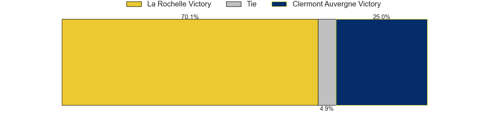

---  
layout: page  
title: La Rochelle V Clermont Auvergne on 2025/09/13  
date: 2025-09-13  
categories: "Top 14 25/26" match projection  
---
# La Rochelle V Clermont Auvergne on 2025/09/13, 34.0 to 16.0

# Club Level Predictions

Now that the game has been played, lets see how the club predictions did. I predicted La Rochelle to win by 4.22, and La Rochelle won by 18.0. That's an absolute error of 13.8 for the margin of victory, while my average absolute error has been 14.5 over the past six months. This prediction was more accurate than 38.7% of my recent predictions.

For the Over/Under model, I predicted a total of 45.5 and we have an actual total of 50.0. That's an absolute error of 4.5 compared to a six month average of 13.6. This prediction was more accurate than 79.7% of my recent predictions.
## Projected Performances - Club Model

## Projected Spreads - Club Model

## Projected Results - Club Model

