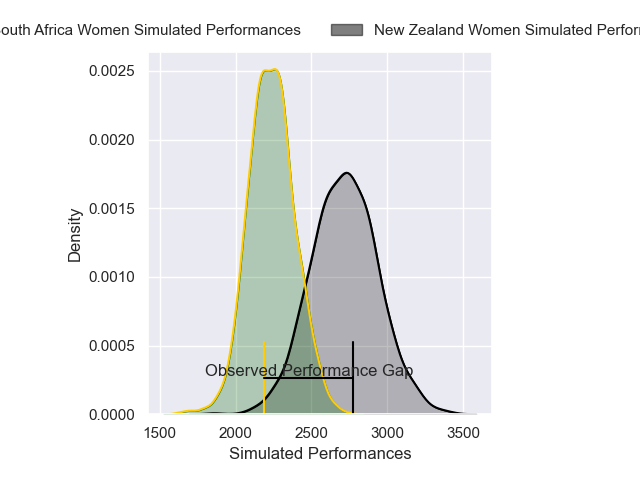
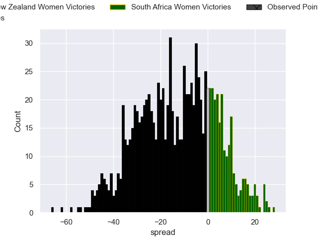

---  
layout: page  
title: New Zealand Women V South Africa Women on 2025/09/13  
date: 2025-09-13  
categories: "Women's Rugby World Cup 2025" match projection  
---
# New Zealand Women V South Africa Women on 2025/09/13, 46.0 to 17.0

# Club Level Predictions

Now that the game has been played, lets see how the club predictions did. I predicted New Zealand Women to win by 12.72, and New Zealand Women won by 29.0. That's an absolute error of 16.3 for the margin of victory, while my average absolute error has been 14.6 over the past six months. This prediction was more accurate than 33.2% of my recent predictions.

For the Over/Under model, I predicted a total of 55.5 and we have an actual total of 63.0. That's an absolute error of 7.5 compared to a six month average of 13.7. This prediction was more accurate than 66.3% of my recent predictions.
## Projected Performances - Club Model

## Projected Spreads - Club Model

## Projected Results - Club Model

