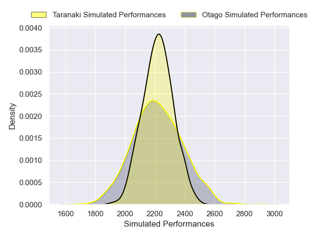

---  
layout: page  
title: Otago V Taranaki on 2025/09/13  
date: 2025-09-13  
categories: "NPC 2025" match projection  
---
# Otago V Taranaki on 2025/09/13, 28.0 to 26.0

# Club Level Predictions

Now that the game has been played, lets see how the club predictions did. I predicted Taranaki to win by 2.48, and Otago won by 2.0. That's an absolute error of 4.5 for the margin of victory, while my average absolute error has been 14.6 over the past six months. This prediction was more accurate than 78.8% of my recent predictions.

For the Over/Under model, I predicted a total of 56.5 and we have an actual total of 54.0. That's an absolute error of 2.5 compared to a six month average of 13.7. This prediction was more accurate than 88.3% of my recent predictions.
## Projected Performances - Club Model

## Projected Spreads - Club Model

## Projected Results - Club Model

