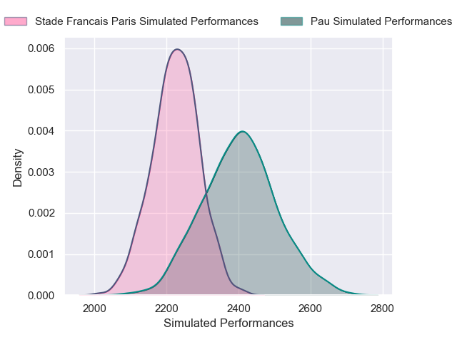
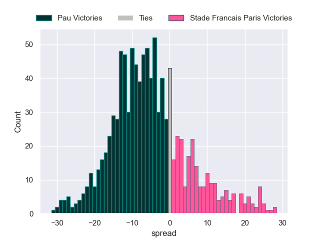

---  
layout: page  
title: Pau V Stade Francais Paris on 2025/09/13  
date: 2025-09-13  
categories: "Top 14 25/26" match projection  
---
# Pau V Stade Francais Paris on 2025/09/13, 34.0 to 10.0

# Club Level Predictions

Now that the game has been played, lets see how the club predictions did. I predicted Pau to win by 4.61, and Pau won by 24.0. That's an absolute error of 19.4 for the margin of victory, while my average absolute error has been 14.6 over the past six months. This prediction was more accurate than 26.3% of my recent predictions.

For the Over/Under model, I predicted a total of 47.5 and we have an actual total of 44.0. That's an absolute error of 3.5 compared to a six month average of 13.7. This prediction was more accurate than 84.2% of my recent predictions.
## Projected Performances - Club Model

## Projected Spreads - Club Model

## Projected Results - Club Model

