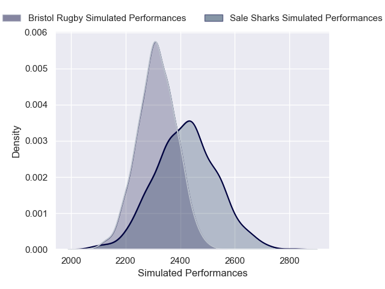
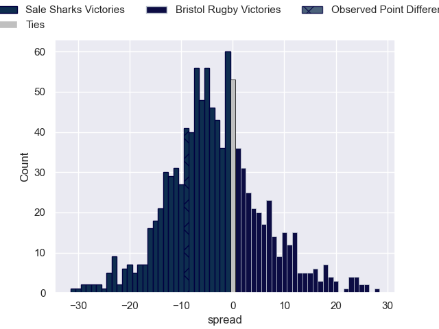

---  
layout: page  
title: Sale Sharks V Bristol Bears on 2025/09/13  
date: 2025-09-13  
categories: "Premiership Rugby Cup 25/26" match projection  
---
# Sale Sharks V Bristol Bears on 2025/09/13, 24.0 to 15.0

# Club Level Predictions

Now that the game has been played, lets see how the club predictions did. I predicted Sale Sharks to win by 2.83, and Sale Sharks won by 9.0. That's an absolute error of 6.2 for the margin of victory, while my average absolute error has been 14.5 over the past six months. This prediction was more accurate than 71.7% of my recent predictions.

For the Over/Under model, I predicted a total of 56.5 and we have an actual total of 39.0. That's an absolute error of 17.5 compared to a six month average of 13.6. This prediction was more accurate than 29.5% of my recent predictions.
## Projected Performances - Club Model

## Projected Spreads - Club Model

## Projected Results - Club Model

