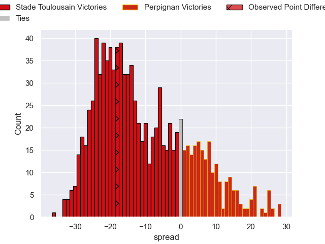

---  
layout: page  
title: Stade Toulousain V Perpignan on 2025/09/13  
date: 2025-09-13  
categories: "Top 14 25/26" match projection  
---
# Stade Toulousain V Perpignan on 2025/09/13, 31.0 to 13.0

# Club Level Predictions

Now that the game has been played, lets see how the club predictions did. I predicted Stade Toulousain to win by 10.6, and Stade Toulousain won by 18.0. That's an absolute error of 7.4 for the margin of victory, while my average absolute error has been 14.5 over the past six months. This prediction was more accurate than 65.6% of my recent predictions.

For the Over/Under model, I predicted a total of 50.5 and we have an actual total of 44.0. That's an absolute error of 6.5 compared to a six month average of 13.6. This prediction was more accurate than 69.4% of my recent predictions.
## Projected Performances - Club Model

## Projected Spreads - Club Model

## Projected Results - Club Model

