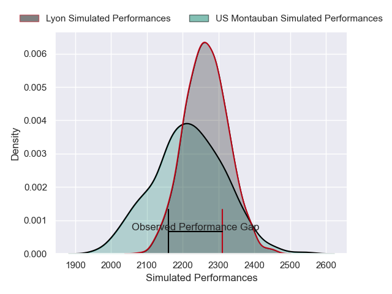
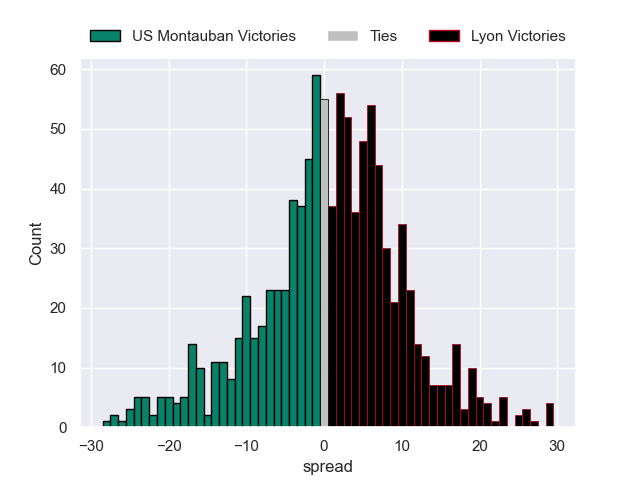

---  
layout: page  
title: US Montauban V Lyon on 2025/09/13  
date: 2025-09-13  
categories: "Top 14 25/26" match projection  
---
# US Montauban V Lyon on 2025/09/13, 18.0 to 25.0

# Club Level Predictions

Now that the game has been played, lets see how the club predictions did. I predicted Lyon to win by 1.87, and Lyon won by 7.0. That's an absolute error of 5.1 for the margin of victory, while my average absolute error has been 14.5 over the past six months. This prediction was more accurate than 75.3% of my recent predictions.

For the Over/Under model, I predicted a total of 52.5 and we have an actual total of 43.0. That's an absolute error of 9.5 compared to a six month average of 13.6. This prediction was more accurate than 57.1% of my recent predictions.
## Projected Performances - Club Model

## Projected Spreads - Club Model

## Projected Results - Club Model

