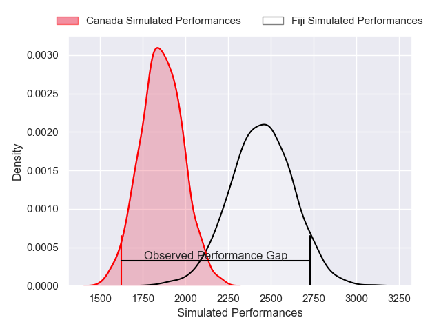
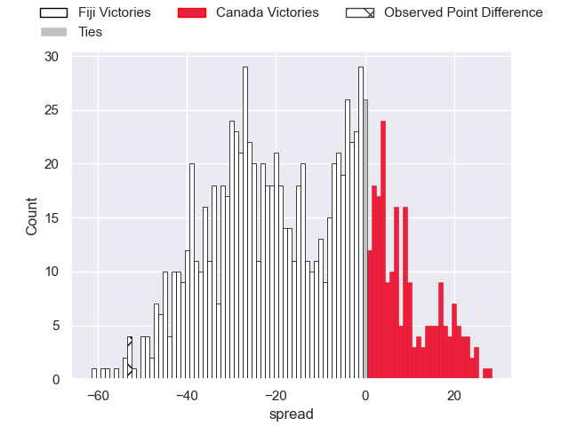

---  
layout: page  
title: Fiji V Canada on 2025/09/14  
date: 2025-09-14  
categories: "Pacific Nations Cup 2025" match projection  
---
# Fiji V Canada on 2025/09/14, 63.0 to 10.0

# Club Level Predictions

Now that the game has been played, lets see how the club predictions did. I predicted Fiji to win by 14.98, and Fiji won by 53.0. That's an absolute error of 38.0 for the margin of victory, while my average absolute error has been 14.6 over the past six months. This prediction was more accurate than 6.5% of my recent predictions.

For the Over/Under model, I predicted a total of 59.5 and we have an actual total of 73.0. That's an absolute error of 13.5 compared to a six month average of 13.7. This prediction was more accurate than 40.6% of my recent predictions.
## Projected Performances - Club Model

## Projected Spreads - Club Model

## Projected Results - Club Model

