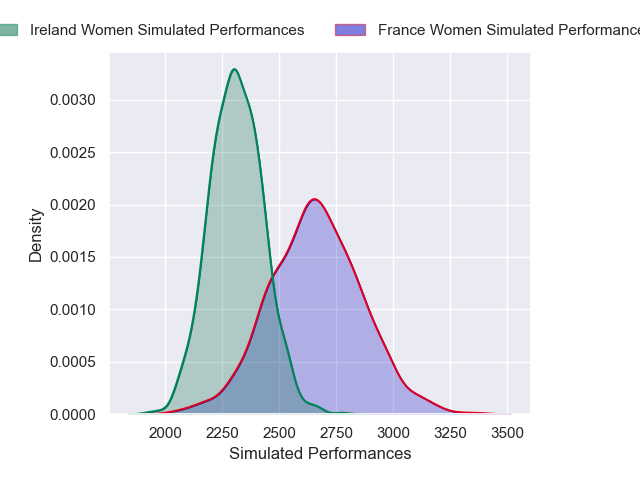
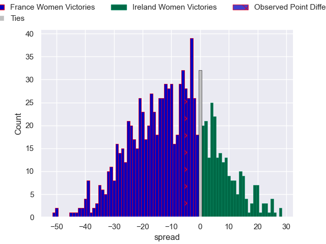

---  
layout: page  
title: France Women V Ireland Women on 2025/09/14  
date: 2025-09-14  
categories: "Women's Rugby World Cup 2025" match projection  
---
# France Women V Ireland Women on 2025/09/14, 18.0 to 13.0

# Club Level Predictions

Now that the game has been played, lets see how the club predictions did. I predicted France Women to win by 9.42, and France Women won by 5.0. That's an absolute error of 4.4 for the margin of victory, while my average absolute error has been 14.5 over the past six months. This prediction was more accurate than 79.0% of my recent predictions.

For the Over/Under model, I predicted a total of 52.5 and we have an actual total of 31.0. That's an absolute error of 21.5 compared to a six month average of 13.6. This prediction was more accurate than 19.9% of my recent predictions.
## Projected Performances - Club Model

## Projected Spreads - Club Model

## Projected Results - Club Model

