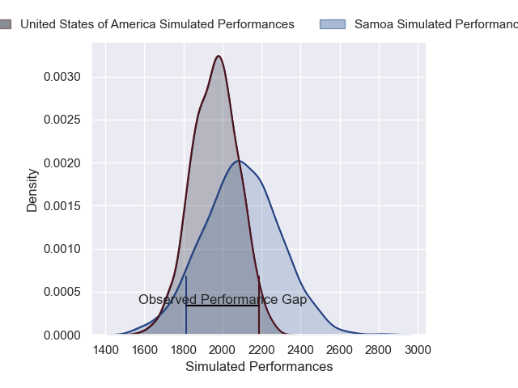
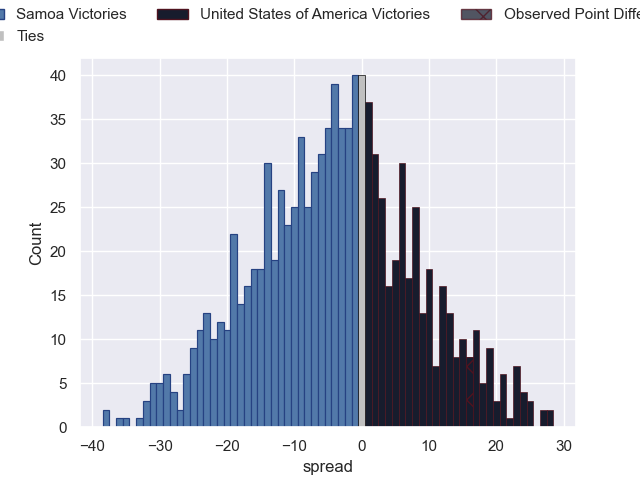

---  
layout: page  
title: Samoa V United States of America on 2025/09/14  
date: 2025-09-14  
categories: "Pacific Nations Cup 2025" match projection  
---
# Samoa V United States of America on 2025/09/14, 13.0 to 29.0

# Club Level Predictions

Now that the game has been played, lets see how the club predictions did. I predicted Samoa to win by 3.48, and United States of America won by 16.0. That's an absolute error of 19.5 for the margin of victory, while my average absolute error has been 14.5 over the past six months. This prediction was more accurate than 25.6% of my recent predictions.

For the Over/Under model, I predicted a total of 51.5 and we have an actual total of 42.0. That's an absolute error of 9.5 compared to a six month average of 13.6. This prediction was more accurate than 57.1% of my recent predictions.
## Projected Performances - Club Model

## Projected Spreads - Club Model

## Projected Results - Club Model

