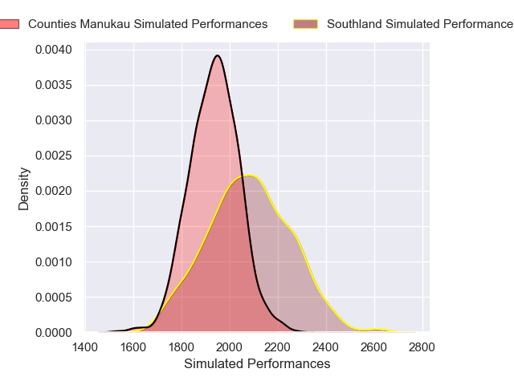
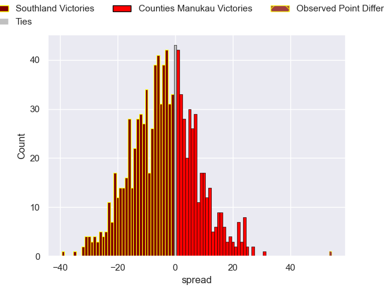

---  
layout: page  
title: Southland V Counties Manukau on 2025/09/14  
date: 2025-09-14  
categories: "NPC 2025" match projection  
---
# Southland V Counties Manukau on 2025/09/14, 10.0 to 64.0

# Club Level Predictions

Now that the game has been played, lets see how the club predictions did. I predicted Southland to win by 4.82, and Counties Manukau won by 54.0. That's an absolute error of 58.8 for the margin of victory, while my average absolute error has been 14.5 over the past six months. This prediction was more accurate than 1.4% of my recent predictions.

For the Over/Under model, I predicted a total of 54.5 and we have an actual total of 74.0. That's an absolute error of 19.5 compared to a six month average of 13.6. This prediction was more accurate than 24.1% of my recent predictions.
## Projected Performances - Club Model

## Projected Spreads - Club Model

## Projected Results - Club Model

