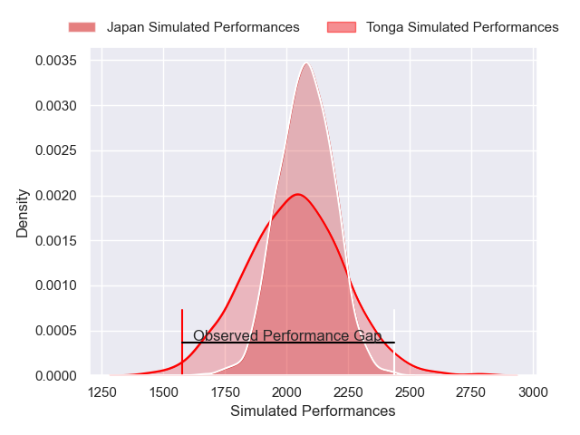
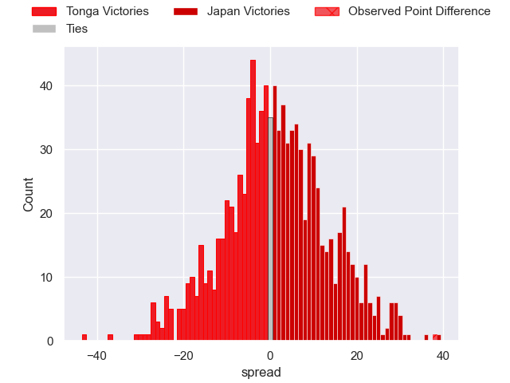

---  
layout: page  
title: Tonga V Japan on 2025/09/14  
date: 2025-09-14  
categories: "Pacific Nations Cup 2025" match projection  
---
# Tonga V Japan on 2025/09/14, 24.0 to 62.0

# Club Level Predictions

Now that the game has been played, lets see how the club predictions did. I predicted Japan to win by 0.83, and Japan won by 38.0. That's an absolute error of 37.2 for the margin of victory, while my average absolute error has been 14.6 over the past six months. This prediction was more accurate than 6.6% of my recent predictions.

For the Over/Under model, I predicted a total of 54.5 and we have an actual total of 86.0. That's an absolute error of 31.5 compared to a six month average of 13.7. This prediction was more accurate than 6.6% of my recent predictions.
## Projected Performances - Club Model

## Projected Spreads - Club Model

## Projected Results - Club Model

