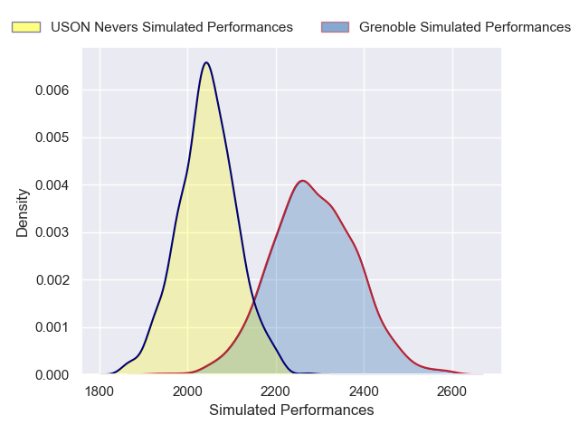
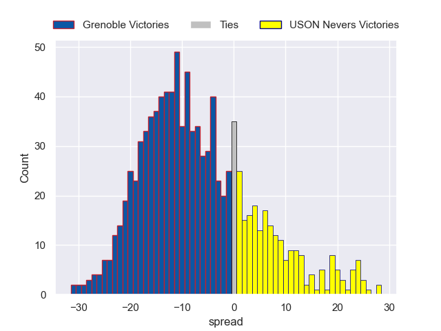
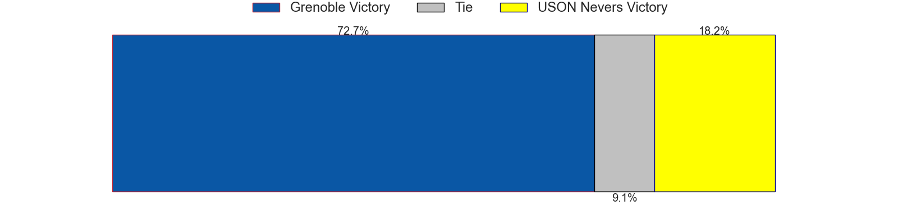

---  
layout: page  
title: Grenoble V USON Nevers on 2025/09/18  
date: 2025-09-18  
categories: "Pro D2 25/26" match projection  
---
# Grenoble V USON Nevers on 2025/09/18, 20.0 to 17.0

# Club Level Predictions

Now that the game has been played, lets see how the club predictions did. I predicted Grenoble to win by 6.83, and Grenoble won by 3.0. That's an absolute error of 3.8 for the margin of victory, while my average absolute error has been 14.7 over the past six months. This prediction was more accurate than 82.2% of my recent predictions.

For the Over/Under model, I predicted a total of 49.5 and we have an actual total of 37.0. That's an absolute error of 12.5 compared to a six month average of 13.7. This prediction was more accurate than 45.2% of my recent predictions.
## Projected Performances - Club Model

## Projected Spreads - Club Model

## Projected Results - Club Model

