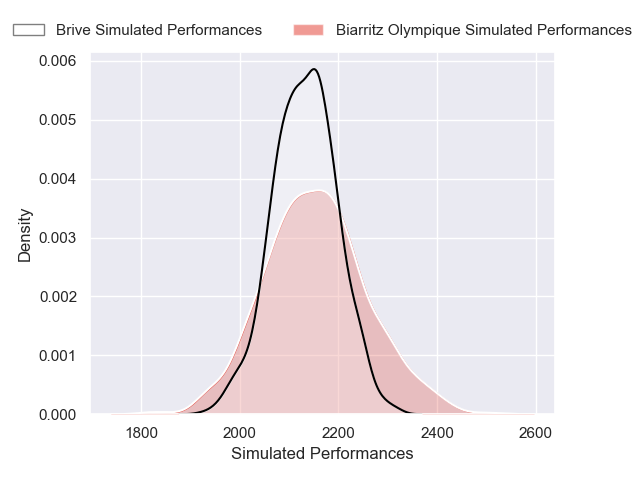
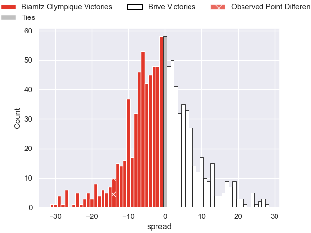

---  
layout: page  
title: Biarritz Olympique V Brive on 2025/09/19  
date: 2025-09-19  
categories: "Pro D2 25/26" match projection  
---
# Biarritz Olympique V Brive on 2025/09/19, 17.0 to 3.0

# Club Level Predictions

Now that the game has been played, lets see how the club predictions did. I predicted Biarritz Olympique to win by 1.2, and Biarritz Olympique won by 14.0. That's an absolute error of 12.8 for the margin of victory, while my average absolute error has been 14.6 over the past six months. This prediction was more accurate than 42.9% of my recent predictions.

For the Over/Under model, I predicted a total of 48.5 and we have an actual total of 20.0. That's an absolute error of 28.5 compared to a six month average of 13.7. This prediction was more accurate than 9.7% of my recent predictions.
## Projected Performances - Club Model

## Projected Spreads - Club Model

## Projected Results - Club Model

