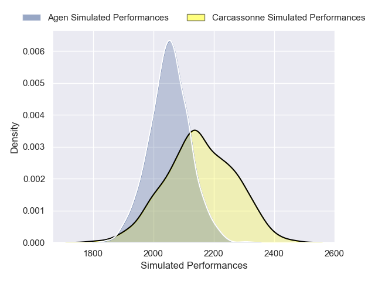
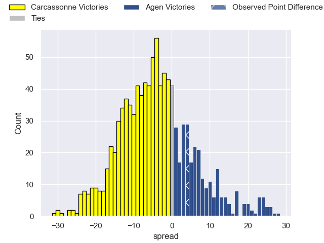
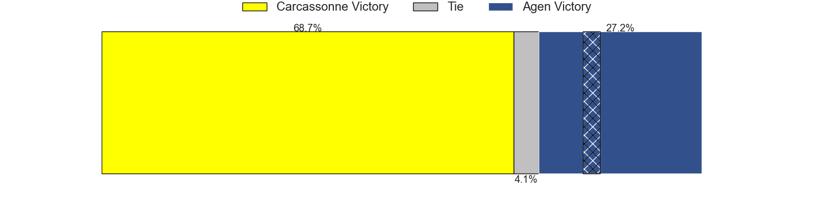

---  
layout: page  
title: Carcassonne V Agen on 2025/09/19  
date: 2025-09-19  
categories: "Pro D2 25/26" match projection  
---
# Carcassonne V Agen on 2025/09/19, 13.0 to 17.0

# Club Level Predictions

Now that the game has been played, lets see how the club predictions did. I predicted Carcassonne to win by 3.89, and Agen won by 4.0. That's an absolute error of 7.9 for the margin of victory, while my average absolute error has been 14.7 over the past six months. This prediction was more accurate than 64.0% of my recent predictions.

For the Over/Under model, I predicted a total of 43.5 and we have an actual total of 30.0. That's an absolute error of 13.5 compared to a six month average of 13.7. This prediction was more accurate than 40.9% of my recent predictions.
## Projected Performances - Club Model

## Projected Spreads - Club Model

## Projected Results - Club Model

