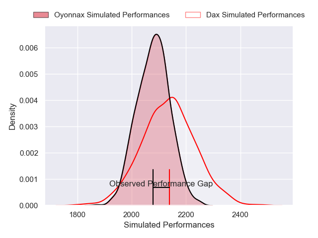
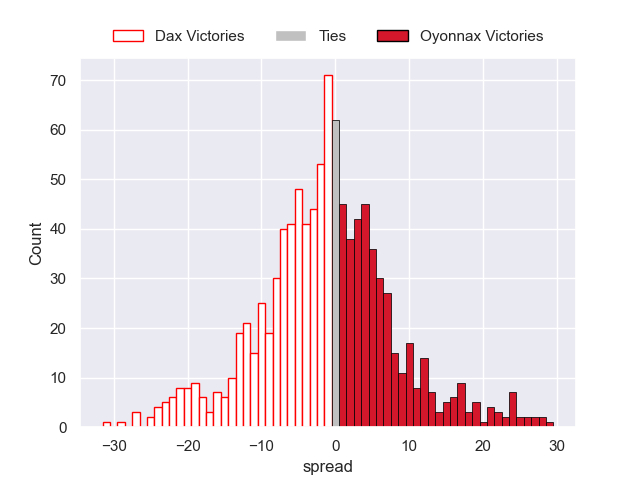

---  
layout: page  
title: Dax V Oyonnax on 2025/09/19  
date: 2025-09-19  
categories: "Pro D2 25/26" match projection  
---
# Dax V Oyonnax on 2025/09/19, 18.0 to 14.0

# Club Level Predictions

Now that the game has been played, lets see how the club predictions did. I predicted Dax to win by 1.54, and Dax won by 4.0. That's an absolute error of 2.5 for the margin of victory, while my average absolute error has been 14.7 over the past six months. This prediction was more accurate than 88.5% of my recent predictions.

For the Over/Under model, I predicted a total of 46.5 and we have an actual total of 32.0. That's an absolute error of 14.5 compared to a six month average of 13.7. This prediction was more accurate than 37.7% of my recent predictions.
## Projected Performances - Club Model

## Projected Spreads - Club Model

## Projected Results - Club Model

