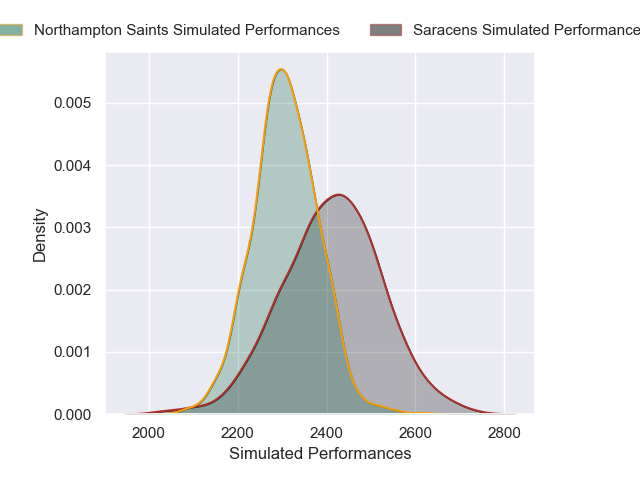
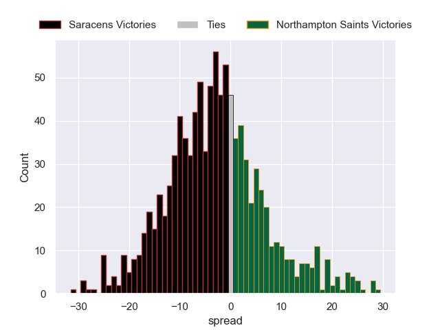

---  
layout: page  
title: Saracens V Northampton Saints on 2025/09/19  
date: 2025-09-19  
categories: "Premiership Rugby Cup 25/26" match projection  
---
# Saracens V Northampton Saints on 2025/09/19, 34.0 to 49.0

# Club Level Predictions

Now that the game has been played, lets see how the club predictions did. I predicted Saracens to win by 2.98, and Northampton Saints won by 15.0. That's an absolute error of 18.0 for the margin of victory, while my average absolute error has been 14.7 over the past six months. This prediction was more accurate than 29.8% of my recent predictions.

For the Over/Under model, I predicted a total of 54.5 and we have an actual total of 83.0. That's an absolute error of 28.5 compared to a six month average of 13.7. This prediction was more accurate than 9.7% of my recent predictions.
## Projected Performances - Club Model

## Projected Spreads - Club Model

## Projected Results - Club Model

