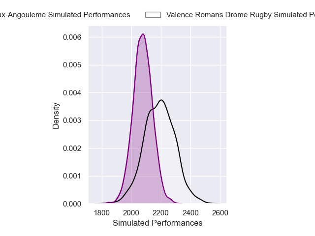
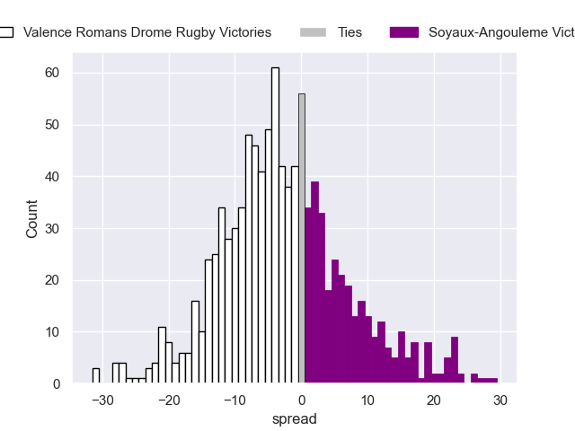
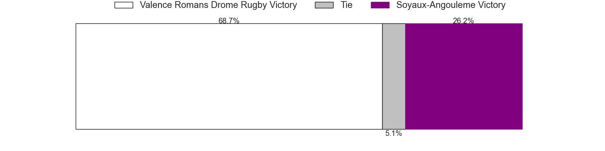

---  
layout: page  
title: Valence Romans Drome Rugby V Soyaux-Angouleme on 2025/09/19  
date: 2025-09-19  
categories: "Pro D2 25/26" match projection  
---
# Valence Romans Drome Rugby V Soyaux-Angouleme on 2025/09/19, 31.0 to 0.0

# Club Level Predictions

Now that the game has been played, lets see how the club predictions did. I predicted Valence Romans Drome Rugby to win by 3.67, and Valence Romans Drome Rugby won by 31.0. That's an absolute error of 27.3 for the margin of victory, while my average absolute error has been 14.7 over the past six months. This prediction was more accurate than 13.4% of my recent predictions.

For the Over/Under model, I predicted a total of 48.5 and we have an actual total of 31.0. That's an absolute error of 17.5 compared to a six month average of 13.7. This prediction was more accurate than 29.5% of my recent predictions.
## Projected Performances - Club Model

## Projected Spreads - Club Model

## Projected Results - Club Model

