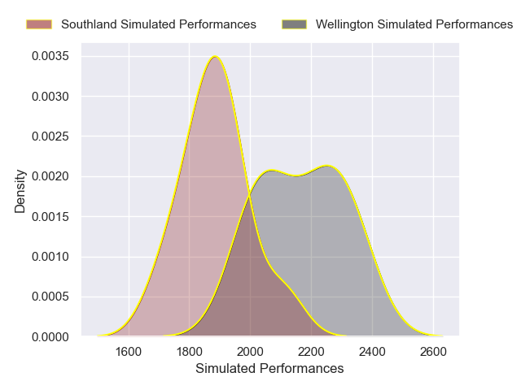
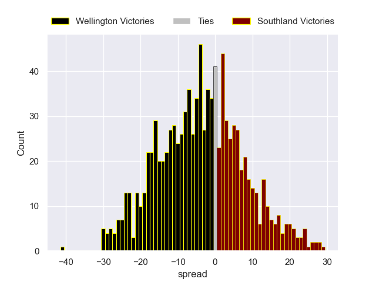

---  
layout: page  
title: Wellington V Southland on 2025/09/19  
date: 2025-09-19  
categories: "NPC 2025" match projection  
---
# Wellington V Southland on 2025/09/19, 75.0 to 19.0

# Club Level Predictions

Now that the game has been played, lets see how the club predictions did. I predicted Wellington to win by 3.52, and Wellington won by 56.0. That's an absolute error of 52.5 for the margin of victory, while my average absolute error has been 14.7 over the past six months. This prediction was more accurate than 2.5% of my recent predictions.

For the Over/Under model, I predicted a total of 59.5 and we have an actual total of 94.0. That's an absolute error of 34.5 compared to a six month average of 13.7. This prediction was more accurate than 5.0% of my recent predictions.
## Projected Performances - Club Model

## Projected Spreads - Club Model

## Projected Results - Club Model

