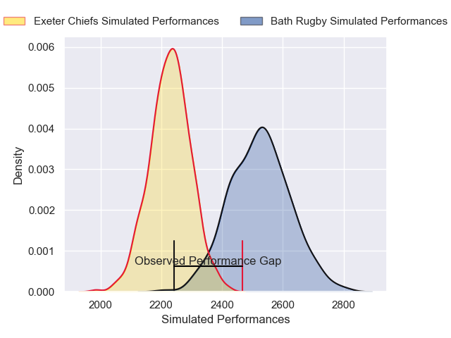
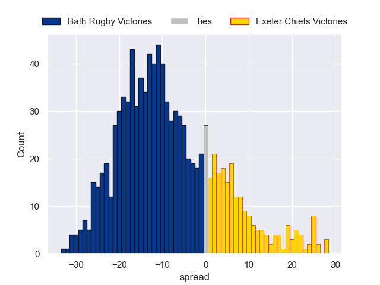

---  
layout: page  
title: Bath Rugby V Exeter Chiefs on 2025/09/20  
date: 2025-09-20  
categories: "Premiership Rugby Cup 25/26" match projection  
---
# Bath Rugby V Exeter Chiefs on 2025/09/20, 14.0 to 23.0

# Club Level Predictions

Now that the game has been played, lets see how the club predictions did. I predicted Bath Rugby to win by 8.39, and Exeter Chiefs won by 9.0. That's an absolute error of 17.4 for the margin of victory, while my average absolute error has been 14.7 over the past six months. This prediction was more accurate than 30.5% of my recent predictions.

For the Over/Under model, I predicted a total of 53.5 and we have an actual total of 37.0. That's an absolute error of 16.5 compared to a six month average of 13.7. This prediction was more accurate than 32.6% of my recent predictions.
## Projected Performances - Club Model

## Projected Spreads - Club Model

## Projected Results - Club Model

