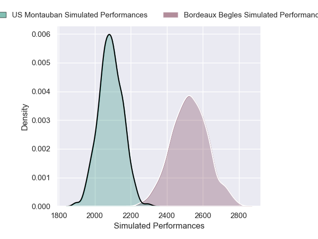
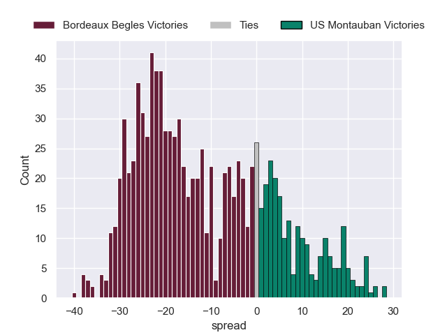

---  
layout: page  
title: Bordeaux Begles V US Montauban on 2025/09/20  
date: 2025-09-20  
categories: "Top 14 25/26" match projection  
---
# Bordeaux Begles V US Montauban on 2025/09/20, 71.0 to 24.0

# Club Level Predictions

Now that the game has been played, lets see how the club predictions did. I predicted Bordeaux Begles to win by 11.8, and Bordeaux Begles won by 47.0. That's an absolute error of 35.2 for the margin of victory, while my average absolute error has been 14.7 over the past six months. This prediction was more accurate than 7.5% of my recent predictions.

For the Over/Under model, I predicted a total of 53.5 and we have an actual total of 95.0. That's an absolute error of 41.5 compared to a six month average of 13.7. This prediction was more accurate than 2.9% of my recent predictions.
## Projected Performances - Club Model

## Projected Spreads - Club Model

## Projected Results - Club Model

