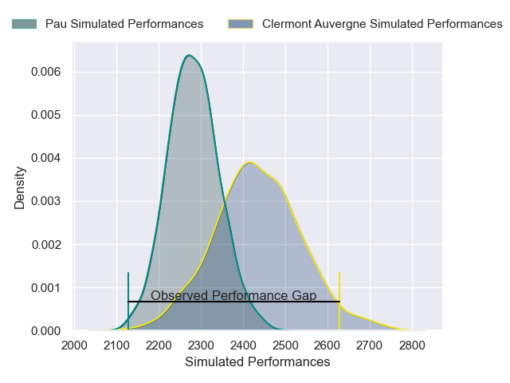
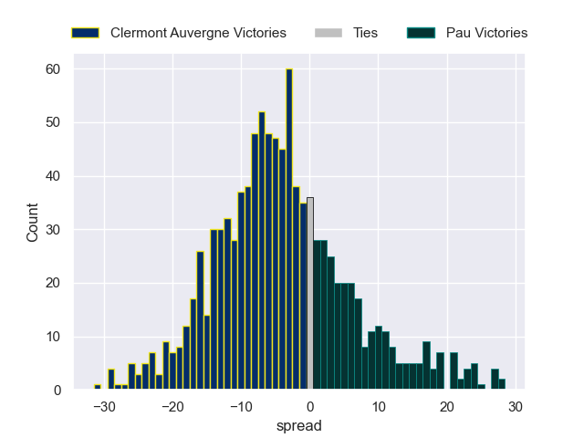

---  
layout: page  
title: Clermont Auvergne V Pau on 2025/09/20  
date: 2025-09-20  
categories: "Top 14 25/26" match projection  
---
# Clermont Auvergne V Pau on 2025/09/20, 50.0 to 27.0

# Club Level Predictions

Now that the game has been played, lets see how the club predictions did. I predicted Clermont Auvergne to win by 4.2, and Clermont Auvergne won by 23.0. That's an absolute error of 18.8 for the margin of victory, while my average absolute error has been 14.7 over the past six months. This prediction was more accurate than 28.2% of my recent predictions.

For the Over/Under model, I predicted a total of 46.5 and we have an actual total of 77.0. That's an absolute error of 30.5 compared to a six month average of 13.7. This prediction was more accurate than 7.6% of my recent predictions.
## Projected Performances - Club Model

## Projected Spreads - Club Model

## Projected Results - Club Model

