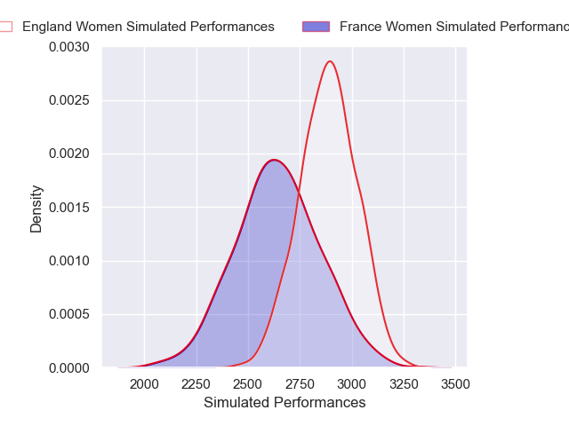
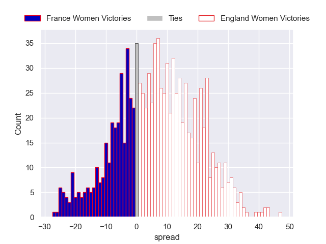

---  
layout: page  
title: France Women V England Women on 2025/09/20  
date: 2025-09-20  
categories: "Women's Rugby World Cup 2025" match projection  
---
# France Women V England Women on 2025/09/20, 17.0 to 35.0

# Club Level Predictions

Now that the game has been played, lets see how the club predictions did. I predicted England Women to win by 6.3, and England Women won by 18.0. That's an absolute error of 11.7 for the margin of victory, while my average absolute error has been 14.7 over the past six months. This prediction was more accurate than 48.0% of my recent predictions.

For the Over/Under model, I predicted a total of 48.5 and we have an actual total of 52.0. That's an absolute error of 3.5 compared to a six month average of 13.7. This prediction was more accurate than 83.7% of my recent predictions.
## Projected Performances - Club Model

## Projected Spreads - Club Model

## Projected Results - Club Model

