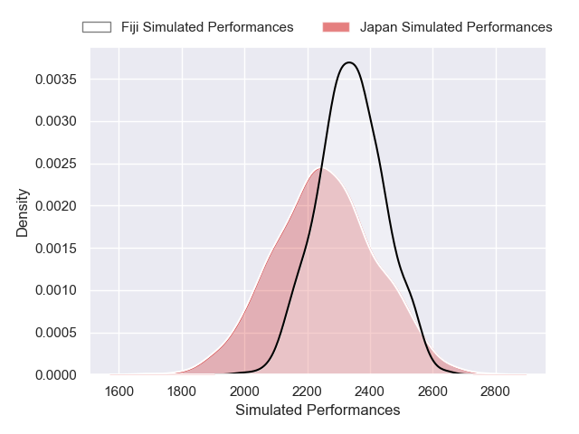
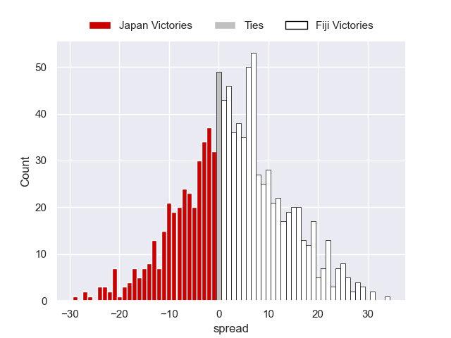

---  
layout: page  
title: Japan V Fiji on 2025/09/20  
date: 2025-09-20  
categories: "Pacific Nations Cup 2025" match projection  
---
# Japan V Fiji on 2025/09/20, 27.0 to 33.0

# Club Level Predictions

Now that the game has been played, lets see how the club predictions did. I predicted Fiji to win by 4.56, and Fiji won by 6.0. That's an absolute error of 1.4 for the margin of victory, while my average absolute error has been 14.7 over the past six months. This prediction was more accurate than 92.9% of my recent predictions.

For the Over/Under model, I predicted a total of 63.5 and we have an actual total of 60.0. That's an absolute error of 3.5 compared to a six month average of 13.7. This prediction was more accurate than 83.7% of my recent predictions.
## Projected Performances - Club Model

## Projected Spreads - Club Model

## Projected Results - Club Model

