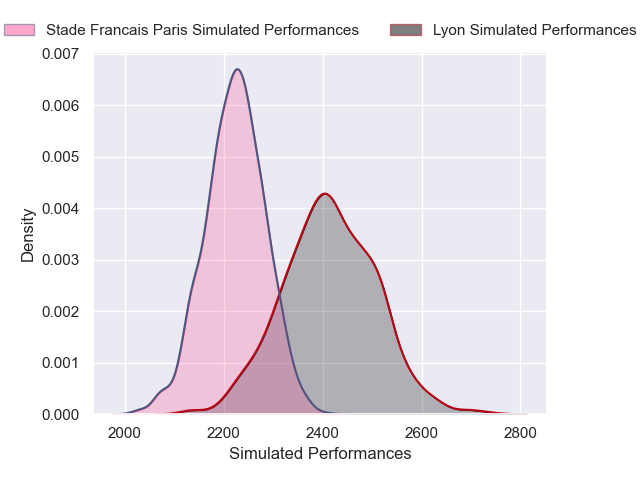

---  
layout: page  
title: Lyon V Stade Francais Paris on 2025/09/20  
date: 2025-09-20  
categories: "Top 14 25/26" match projection  
---
# Lyon V Stade Francais Paris on 2025/09/20, 42.0 to 37.0

# Club Level Predictions

Now that the game has been played, lets see how the club predictions did. I predicted Lyon to win by 4.35, and Lyon won by 5.0. That's an absolute error of 0.7 for the margin of victory, while my average absolute error has been 14.7 over the past six months. This prediction was more accurate than 96.9% of my recent predictions.

For the Over/Under model, I predicted a total of 49.5 and we have an actual total of 79.0. That's an absolute error of 29.5 compared to a six month average of 13.7. This prediction was more accurate than 8.6% of my recent predictions.
## Projected Performances - Club Model

## Projected Spreads - Club Model

## Projected Results - Club Model

