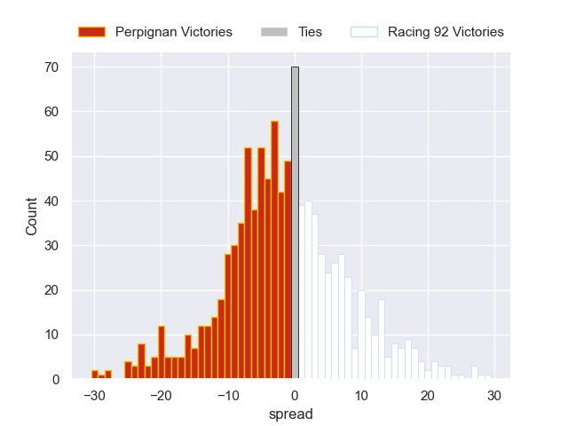

---  
layout: page  
title: Perpignan V Racing 92 on 2025/09/20  
date: 2025-09-20  
categories: "Top 14 25/26" match projection  
---
# Perpignan V Racing 92 on 2025/09/20, 15.0 to 28.0

# Club Level Predictions

Now that the game has been played, lets see how the club predictions did. I predicted Perpignan to win by 1.16, and Racing 92 won by 13.0. That's an absolute error of 14.2 for the margin of victory, while my average absolute error has been 14.7 over the past six months. This prediction was more accurate than 39.2% of my recent predictions.

For the Over/Under model, I predicted a total of 49.5 and we have an actual total of 43.0. That's an absolute error of 6.5 compared to a six month average of 13.7. This prediction was more accurate than 69.8% of my recent predictions.
## Projected Performances - Club Model

## Projected Spreads - Club Model

## Projected Results - Club Model

