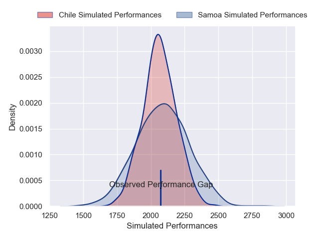
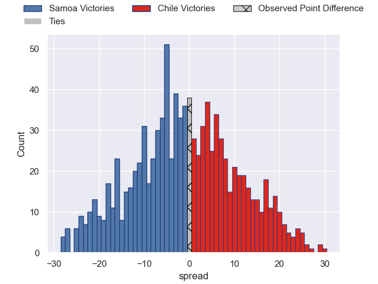

---  
layout: page  
title: Samoa V Chile on 2025/09/20  
date: 2025-09-20  
categories: "International Test Match 2025" match projection  
---
# Samoa V Chile on 2025/09/20, 32.0 to 32.0

# Club Level Predictions

Now that the game has been played, lets see how the club predictions did. I predicted Samoa to win by 0.82, and Chile won by 0.0. That's an absolute error of 0.8 for the margin of victory, while my average absolute error has been 14.7 over the past six months. This prediction was more accurate than 96.2% of my recent predictions.

For the Over/Under model, I predicted a total of 49.5 and we have an actual total of 64.0. That's an absolute error of 14.5 compared to a six month average of 13.7. This prediction was more accurate than 37.7% of my recent predictions.
## Projected Performances - Club Model

## Projected Spreads - Club Model

## Projected Results - Club Model

