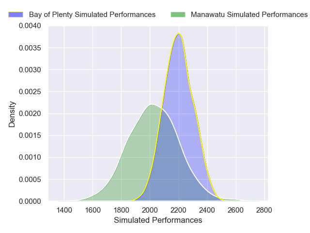
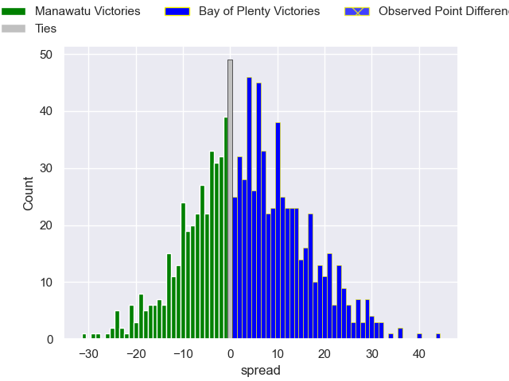

---  
layout: page  
title: Manawatu V Bay of Plenty on 2025/09/21  
date: 2025-09-21  
categories: "NPC 2025" match projection  
---
# Manawatu V Bay of Plenty on 2025/09/21, 19.0 to 55.0

# Club Level Predictions

Now that the game has been played, lets see how the club predictions did. I predicted Bay of Plenty to win by 3.61, and Bay of Plenty won by 36.0. That's an absolute error of 32.4 for the margin of victory, while my average absolute error has been 14.7 over the past six months. This prediction was more accurate than 8.4% of my recent predictions.

For the Over/Under model, I predicted a total of 68.5 and we have an actual total of 74.0. That's an absolute error of 5.5 compared to a six month average of 13.7. This prediction was more accurate than 74.7% of my recent predictions.
## Projected Performances - Club Model

## Projected Spreads - Club Model

## Projected Results - Club Model

