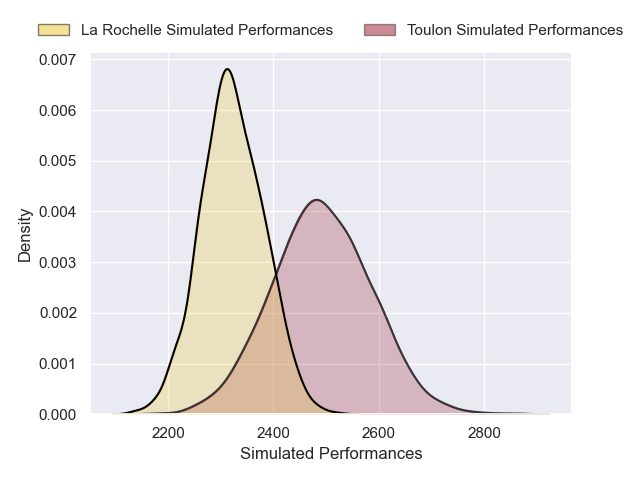
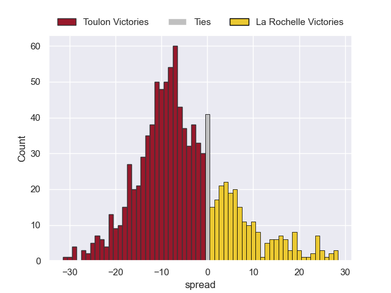

---  
layout: page  
title: Toulon V La Rochelle on 2025/09/21  
date: 2025-09-21  
categories: "Top 14 25/26" match projection  
---
# Toulon V La Rochelle on 2025/09/21, 0.0 to 0.0

# Club Level Predictions

Now that the game has been played, lets see how the club predictions did. I predicted Toulon to win by 4.98, and La Rochelle won by 0.0. That's an absolute error of 5.0 for the margin of victory, while my average absolute error has been 14.7 over the past six months. This prediction was more accurate than 76.3% of my recent predictions.

For the Over/Under model, I predicted a total of 44.5 and we have an actual total of 0.0. That's an absolute error of 44.5 compared to a six month average of 13.7. This prediction was more accurate than 2.1% of my recent predictions.
## Projected Performances - Club Model

## Projected Spreads - Club Model

## Projected Results - Club Model

