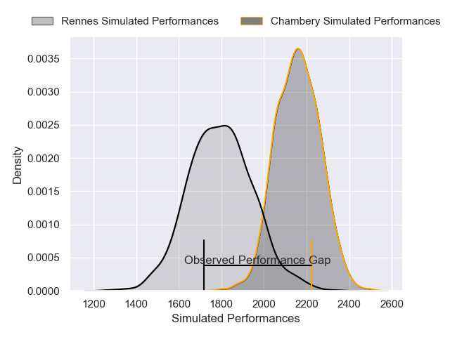
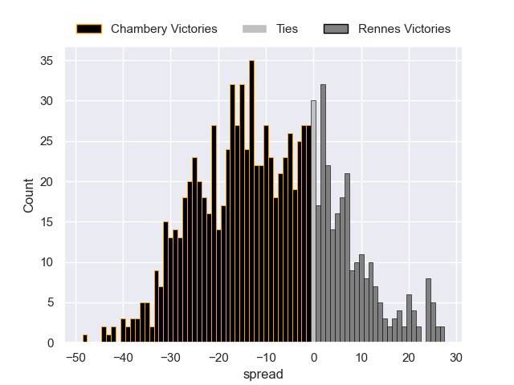
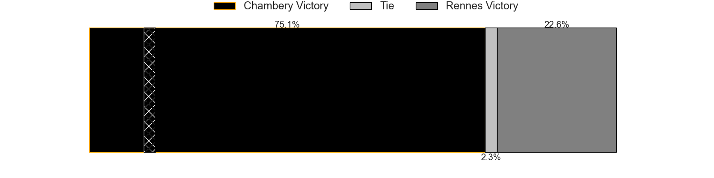

---  
layout: page  
title: Chambery V Rennes on 2025/09/26  
date: 2025-09-26  
categories: "Nationale 25/26" match projection  
---
# Chambery V Rennes on 2025/09/26, 29.0 to 3.0

# Club Level Predictions

Now that the game has been played, lets see how the club predictions did. I predicted Chambery to win by 10.1, and Chambery won by 26.0. That's an absolute error of 15.9 for the margin of victory, while my average absolute error has been 14.5 over the past six months. This prediction was more accurate than 33.9% of my recent predictions.

For the Over/Under model, I predicted a total of 44.5 and we have an actual total of 32.0. That's an absolute error of 12.5 compared to a six month average of 13.8. This prediction was more accurate than 45.7% of my recent predictions.
## Projected Performances - Club Model

## Projected Spreads - Club Model

## Projected Results - Club Model

