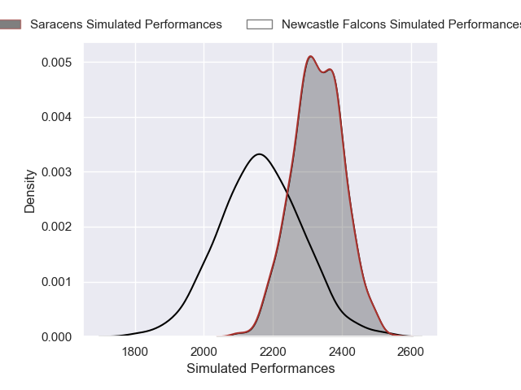
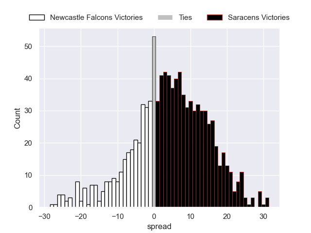

---  
layout: page  
title: Newcastle Falcons V Saracens on 2025/09/26  
date: 2025-09-26  
categories: "Gallagher Premiership 25/26" match projection  
---
# Newcastle Falcons V Saracens on 2025/09/26, 17.0 to 39.0

# Club Level Predictions

Now that the game has been played, lets see how the club predictions did. I predicted Saracens to win by 4.23, and Saracens won by 22.0. That's an absolute error of 17.8 for the margin of victory, while my average absolute error has been 14.5 over the past six months. This prediction was more accurate than 30.1% of my recent predictions.

For the Over/Under model, I predicted a total of 61.5 and we have an actual total of 56.0. That's an absolute error of 5.5 compared to a six month average of 13.8. This prediction was more accurate than 75.1% of my recent predictions.
## Projected Performances - Club Model

## Projected Spreads - Club Model

## Projected Results - Club Model

