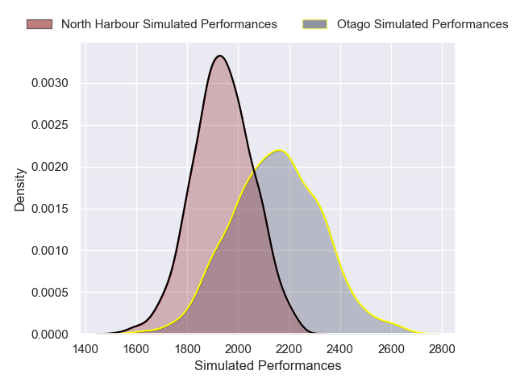
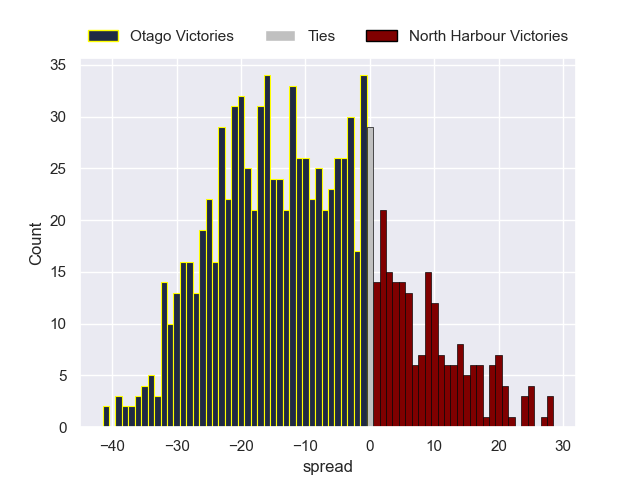

---  
layout: page  
title: Otago V North Harbour on 2025/09/26  
date: 2025-09-26  
categories: "NPC 2025" match projection  
---
# Otago V North Harbour on 2025/09/26, 41.0 to 26.0

# Club Level Predictions

Now that the game has been played, lets see how the club predictions did. I predicted Otago to win by 8.91, and Otago won by 15.0. That's an absolute error of 6.1 for the margin of victory, while my average absolute error has been 14.6 over the past six months. This prediction was more accurate than 72.2% of my recent predictions.

For the Over/Under model, I predicted a total of 58.5 and we have an actual total of 67.0. That's an absolute error of 8.5 compared to a six month average of 13.7. This prediction was more accurate than 60.5% of my recent predictions.
## Projected Performances - Club Model

## Projected Spreads - Club Model

## Projected Results - Club Model

