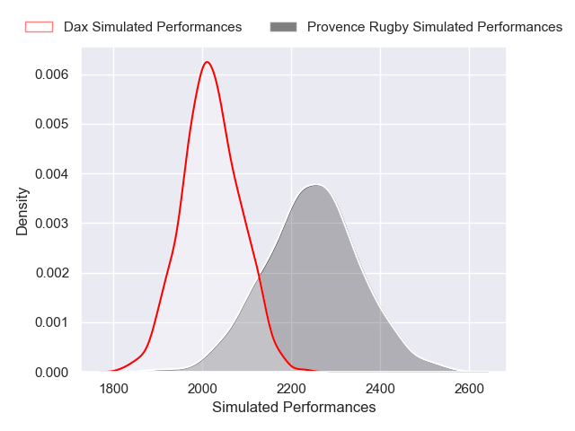
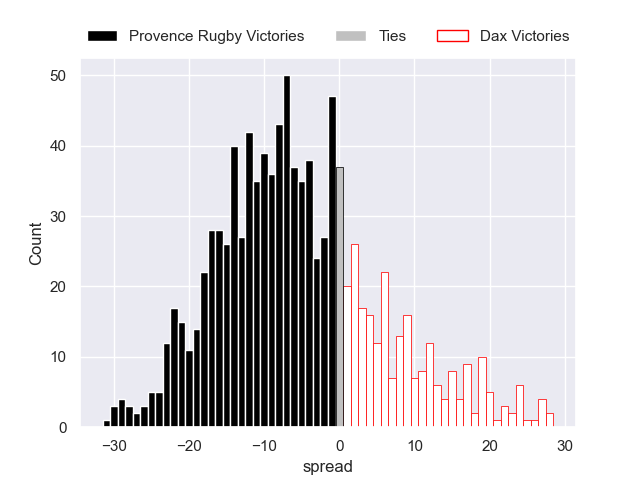

---  
layout: page  
title: Provence Rugby V Dax on 2025/09/26  
date: 2025-09-26  
categories: "Pro D2 25/26" match projection  
---
# Provence Rugby V Dax on 2025/09/26, 42.0 to 15.0

# Club Level Predictions

Now that the game has been played, lets see how the club predictions did. I predicted Provence Rugby to win by 6.64, and Provence Rugby won by 27.0. That's an absolute error of 20.4 for the margin of victory, while my average absolute error has been 14.6 over the past six months. This prediction was more accurate than 23.9% of my recent predictions.

For the Over/Under model, I predicted a total of 48.5 and we have an actual total of 57.0. That's an absolute error of 8.5 compared to a six month average of 13.7. This prediction was more accurate than 60.5% of my recent predictions.
## Projected Performances - Club Model

## Projected Spreads - Club Model

## Projected Results - Club Model

