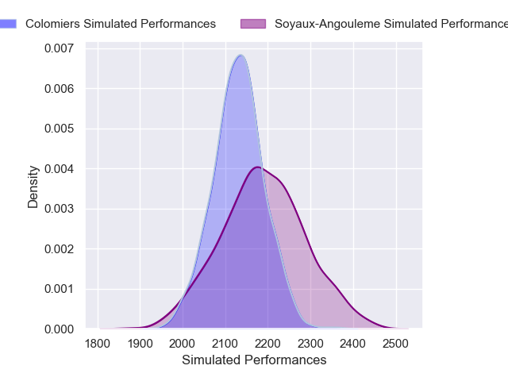
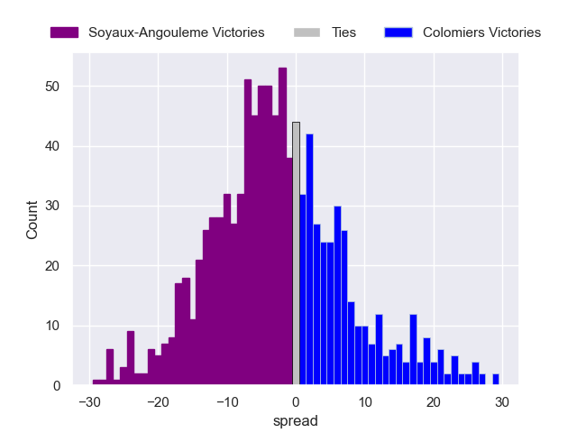

---  
layout: page  
title: Soyaux-Angouleme V Colomiers on 2025/09/26  
date: 2025-09-26  
categories: "Pro D2 25/26" match projection  
---
# Soyaux-Angouleme V Colomiers on 2025/09/26, 15.0 to 37.0

# Club Level Predictions

Now that the game has been played, lets see how the club predictions did. I predicted Soyaux-Angouleme to win by 2.32, and Colomiers won by 22.0. That's an absolute error of 24.3 for the margin of victory, while my average absolute error has been 14.6 over the past six months. This prediction was more accurate than 17.2% of my recent predictions.

For the Over/Under model, I predicted a total of 47.5 and we have an actual total of 52.0. That's an absolute error of 4.5 compared to a six month average of 13.7. This prediction was more accurate than 78.8% of my recent predictions.
## Projected Performances - Club Model

## Projected Spreads - Club Model

## Projected Results - Club Model

