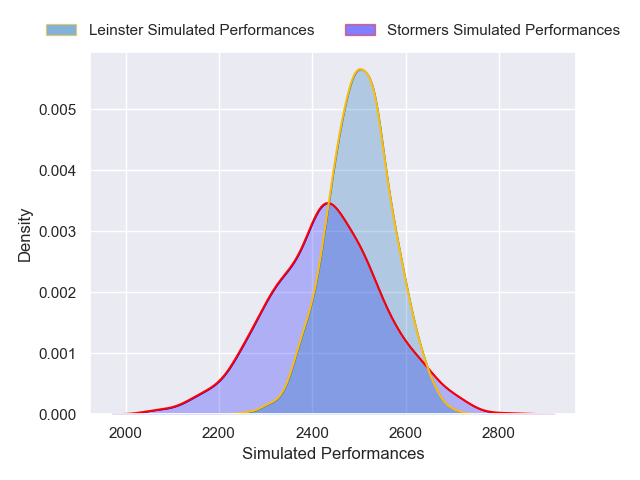
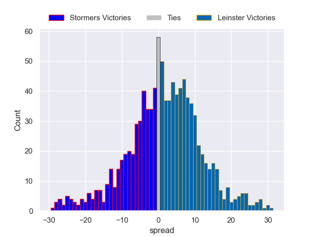

---  
layout: page  
title: Stormers V Leinster on 2025/09/26  
date: 2025-09-26  
categories: "United Rugby Championship 25/26" match projection  
---
# Stormers V Leinster on 2025/09/26, 35.0 to 0.0

# Club Level Predictions

Now that the game has been played, lets see how the club predictions did. I predicted Leinster to win by 1.81, and Stormers won by 35.0. That's an absolute error of 36.8 for the margin of victory, while my average absolute error has been 14.6 over the past six months. This prediction was more accurate than 6.7% of my recent predictions.

For the Over/Under model, I predicted a total of 50.5 and we have an actual total of 35.0. That's an absolute error of 15.5 compared to a six month average of 13.7. This prediction was more accurate than 35.1% of my recent predictions.
## Projected Performances - Club Model

## Projected Spreads - Club Model

## Projected Results - Club Model

