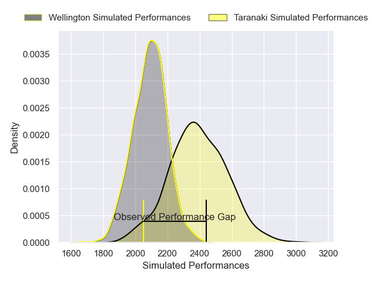
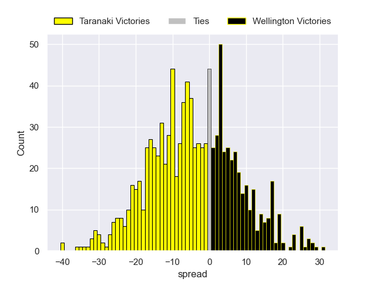
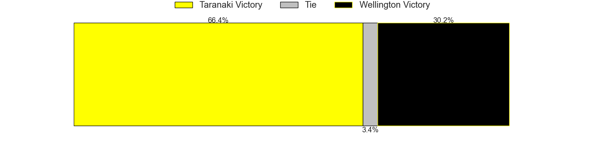

---  
layout: page  
title: Taranaki V Wellington on 2025/09/26  
date: 2025-09-26  
categories: "NPC 2025" match projection  
---
# Taranaki V Wellington on 2025/09/26, 39.0 to 20.0

# Club Level Predictions

Now that the game has been played, lets see how the club predictions did. I predicted Taranaki to win by 8.06, and Taranaki won by 19.0. That's an absolute error of 10.9 for the margin of victory, while my average absolute error has been 14.5 over the past six months. This prediction was more accurate than 49.0% of my recent predictions.

For the Over/Under model, I predicted a total of 60.5 and we have an actual total of 59.0. That's an absolute error of 1.5 compared to a six month average of 13.8. This prediction was more accurate than 92.4% of my recent predictions.
## Projected Performances - Club Model

## Projected Spreads - Club Model

## Projected Results - Club Model

