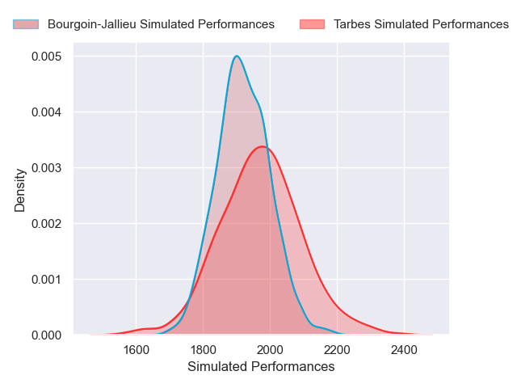
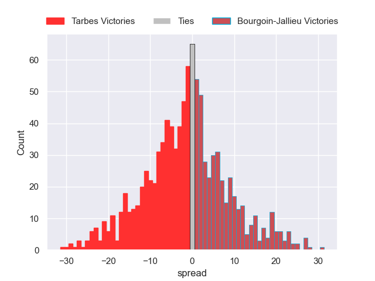

---  
layout: page  
title: Tarbes V Bourgoin-Jallieu on 2025/09/26  
date: 2025-09-26  
categories: "Nationale 25/26" match projection  
---
# Tarbes V Bourgoin-Jallieu on 2025/09/26, 15.0 to 8.0

# Club Level Predictions

Now that the game has been played, lets see how the club predictions did. I predicted Tarbes to win by 1.4, and Tarbes won by 7.0. That's an absolute error of 5.6 for the margin of victory, while my average absolute error has been 14.6 over the past six months. This prediction was more accurate than 74.1% of my recent predictions.

For the Over/Under model, I predicted a total of 43.5 and we have an actual total of 23.0. That's an absolute error of 20.5 compared to a six month average of 13.7. This prediction was more accurate than 22.4% of my recent predictions.
## Projected Performances - Club Model

## Projected Spreads - Club Model

## Projected Results - Club Model

