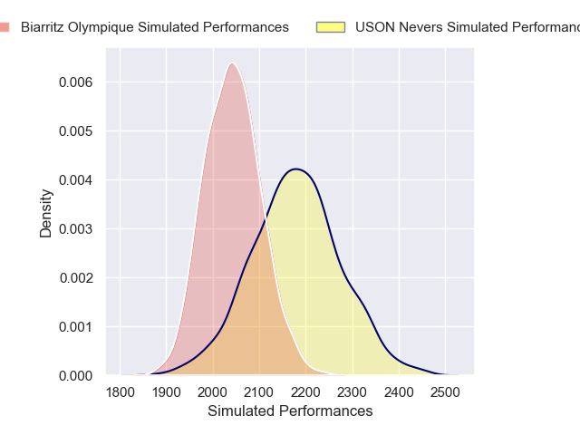
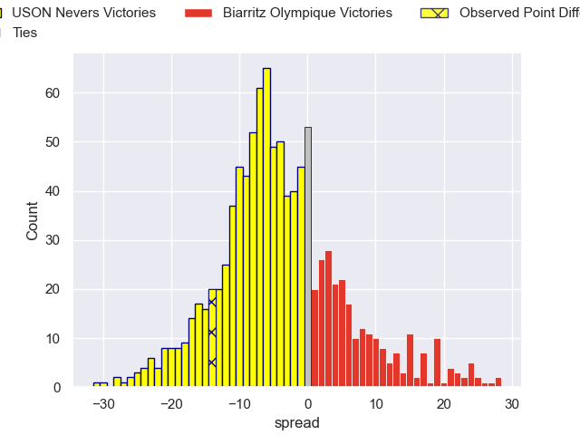
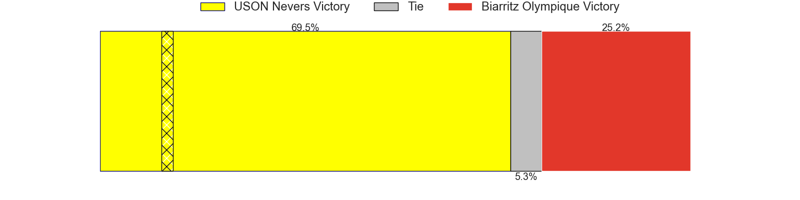

---  
layout: page  
title: USON Nevers V Biarritz Olympique on 2025/09/26  
date: 2025-09-26  
categories: "Pro D2 25/26" match projection  
---
# USON Nevers V Biarritz Olympique on 2025/09/26, 38.0 to 24.0

# Club Level Predictions

Now that the game has been played, lets see how the club predictions did. I predicted USON Nevers to win by 3.87, and USON Nevers won by 14.0. That's an absolute error of 10.1 for the margin of victory, while my average absolute error has been 14.6 over the past six months. This prediction was more accurate than 52.7% of my recent predictions.

For the Over/Under model, I predicted a total of 49.5 and we have an actual total of 62.0. That's an absolute error of 12.5 compared to a six month average of 13.7. This prediction was more accurate than 45.3% of my recent predictions.
## Projected Performances - Club Model

## Projected Spreads - Club Model

## Projected Results - Club Model

