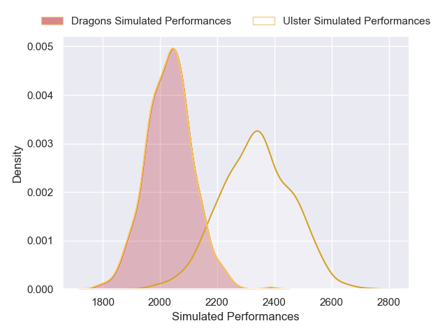
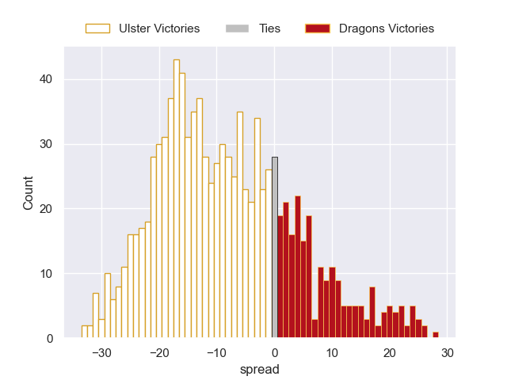

---  
layout: page  
title: Ulster V Dragons on 2025/09/26  
date: 2025-09-26  
categories: "United Rugby Championship 25/26" match projection  
---
# Ulster V Dragons on 2025/09/26, 42.0 to 21.0

# Club Level Predictions

Now that the game has been played, lets see how the club predictions did. I predicted Ulster to win by 8.65, and Ulster won by 21.0. That's an absolute error of 12.4 for the margin of victory, while my average absolute error has been 14.5 over the past six months. This prediction was more accurate than 44.7% of my recent predictions.

For the Over/Under model, I predicted a total of 57.5 and we have an actual total of 63.0. That's an absolute error of 5.5 compared to a six month average of 13.8. This prediction was more accurate than 75.1% of my recent predictions.
## Projected Performances - Club Model

## Projected Spreads - Club Model

## Projected Results - Club Model

