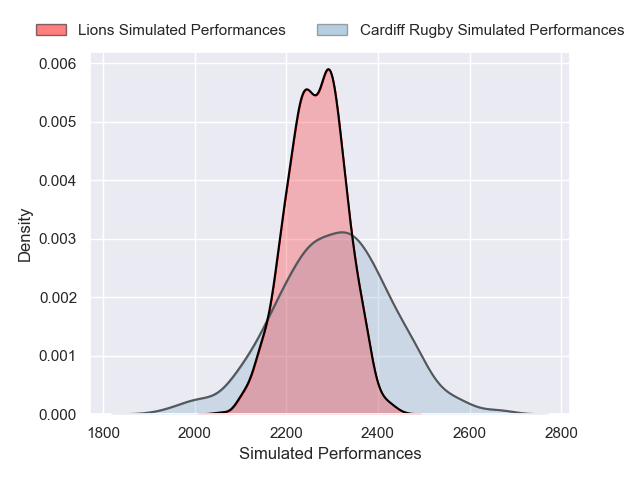
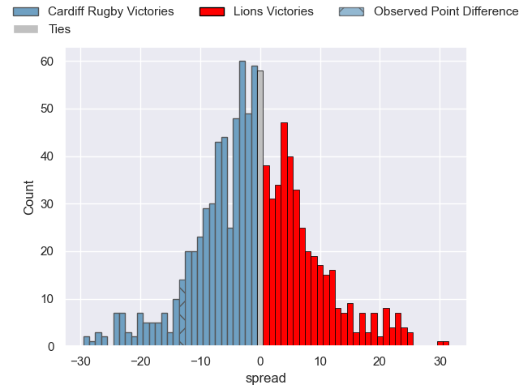

---  
layout: page  
title: Cardiff Rugby V Lions on 2025/09/27  
date: 2025-09-27  
categories: "United Rugby Championship 25/26" match projection  
---
# Cardiff Rugby V Lions on 2025/09/27, 33.0 to 20.0

# Club Level Predictions

Now that the game has been played, lets see how the club predictions did. I predicted Cardiff Rugby to win by 0.75, and Cardiff Rugby won by 13.0. That's an absolute error of 12.2 for the margin of victory, while my average absolute error has been 14.6 over the past six months. This prediction was more accurate than 46.1% of my recent predictions.

For the Over/Under model, I predicted a total of 51.5 and we have an actual total of 53.0. That's an absolute error of 1.5 compared to a six month average of 13.7. This prediction was more accurate than 92.4% of my recent predictions.
## Projected Performances - Club Model

## Projected Spreads - Club Model

## Projected Results - Club Model

