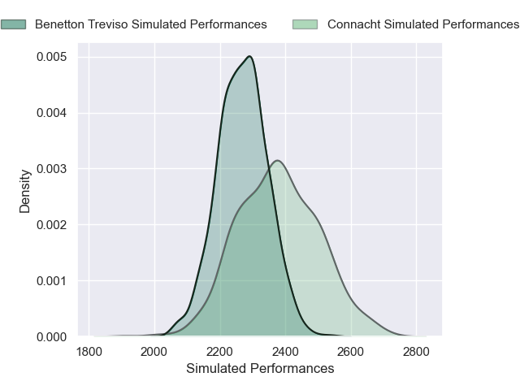
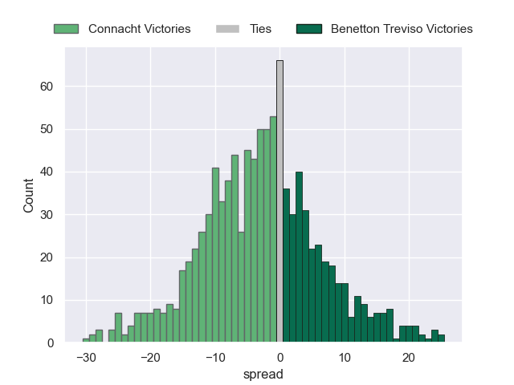
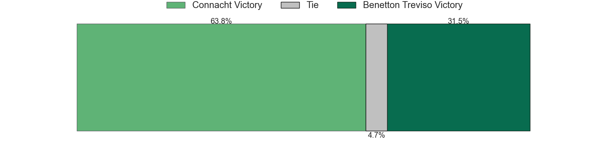

---  
layout: page  
title: Connacht V Benetton Treviso on 2025/09/27  
date: 2025-09-27  
categories: "United Rugby Championship 25/26" match projection  
---
# Connacht V Benetton Treviso on 2025/09/27, 26.0 to 15.0

# Club Level Predictions

Now that the game has been played, lets see how the club predictions did. I predicted Connacht to win by 3.12, and Connacht won by 11.0. That's an absolute error of 7.9 for the margin of victory, while my average absolute error has been 14.6 over the past six months. This prediction was more accurate than 63.6% of my recent predictions.

For the Over/Under model, I predicted a total of 48.5 and we have an actual total of 41.0. That's an absolute error of 7.5 compared to a six month average of 13.7. This prediction was more accurate than 65.3% of my recent predictions.
## Projected Performances - Club Model

## Projected Spreads - Club Model

## Projected Results - Club Model

