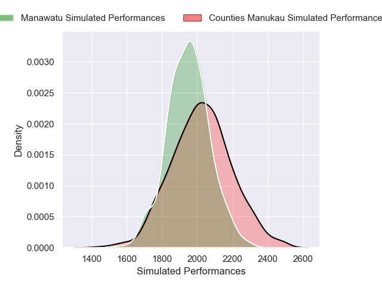
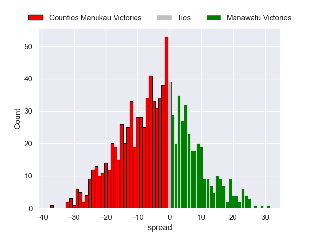

---  
layout: page  
title: Counties Manukau V Manawatu on 2025/09/27  
date: 2025-09-27  
categories: "NPC 2025" match projection  
---
# Counties Manukau V Manawatu on 2025/09/27, 48.0 to 24.0

# Club Level Predictions

Now that the game has been played, lets see how the club predictions did. I predicted Counties Manukau to win by 2.31, and Counties Manukau won by 24.0. That's an absolute error of 21.7 for the margin of victory, while my average absolute error has been 14.5 over the past six months. This prediction was more accurate than 20.9% of my recent predictions.

For the Over/Under model, I predicted a total of 65.5 and we have an actual total of 72.0. That's an absolute error of 6.5 compared to a six month average of 13.8. This prediction was more accurate than 70.5% of my recent predictions.
## Projected Performances - Club Model

## Projected Spreads - Club Model

## Projected Results - Club Model

