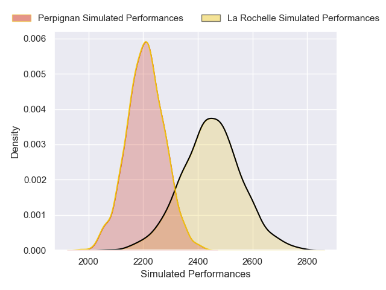
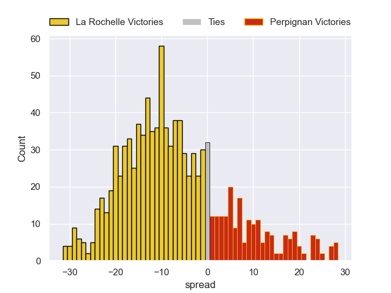

---  
layout: page  
title: La Rochelle V Perpignan on 2025/09/27  
date: 2025-09-27  
categories: "Top 14 25/26" match projection  
---
# La Rochelle V Perpignan on 2025/09/27, 31.0 to 8.0

# Club Level Predictions

Now that the game has been played, lets see how the club predictions did. I predicted La Rochelle to win by 7.15, and La Rochelle won by 23.0. That's an absolute error of 15.8 for the margin of victory, while my average absolute error has been 14.6 over the past six months. This prediction was more accurate than 34.2% of my recent predictions.

For the Over/Under model, I predicted a total of 46.5 and we have an actual total of 39.0. That's an absolute error of 7.5 compared to a six month average of 13.7. This prediction was more accurate than 65.3% of my recent predictions.
## Projected Performances - Club Model

## Projected Spreads - Club Model

## Projected Results - Club Model

