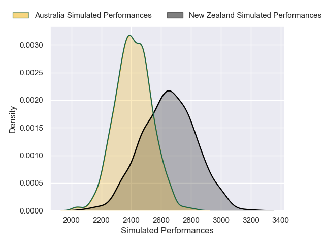
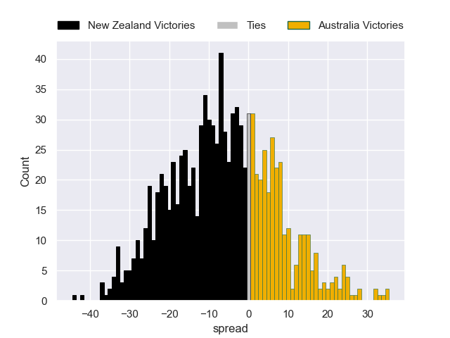

---  
layout: page  
title: New Zealand V Australia on 2025/09/27  
date: 2025-09-27  
categories: "Rugby Championship 2025" match projection  
---
# New Zealand V Australia on 2025/09/27, 33.0 to 24.0

# Club Level Predictions

Now that the game has been played, lets see how the club predictions did. I predicted New Zealand to win by 6.96, and New Zealand won by 9.0. That's an absolute error of 2.0 for the margin of victory, while my average absolute error has been 14.5 over the past six months. This prediction was more accurate than 90.3% of my recent predictions.

For the Over/Under model, I predicted a total of 50.5 and we have an actual total of 57.0. That's an absolute error of 6.5 compared to a six month average of 13.8. This prediction was more accurate than 70.5% of my recent predictions.
## Projected Performances - Club Model

## Projected Spreads - Club Model

## Projected Results - Club Model

