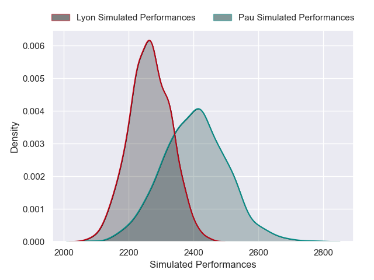
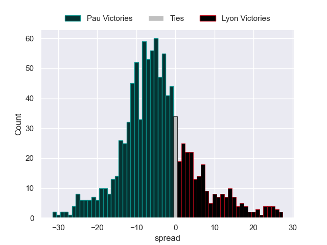

---  
layout: page  
title: Pau V Lyon on 2025/09/27  
date: 2025-09-27  
categories: "Top 14 25/26" match projection  
---
# Pau V Lyon on 2025/09/27, 40.0 to 15.0

# Club Level Predictions

Now that the game has been played, lets see how the club predictions did. I predicted Pau to win by 3.66, and Pau won by 25.0. That's an absolute error of 21.3 for the margin of victory, while my average absolute error has been 14.6 over the past six months. This prediction was more accurate than 22.0% of my recent predictions.

For the Over/Under model, I predicted a total of 53.5 and we have an actual total of 55.0. That's an absolute error of 1.5 compared to a six month average of 13.7. This prediction was more accurate than 92.4% of my recent predictions.
## Projected Performances - Club Model

## Projected Spreads - Club Model

## Projected Results - Club Model

