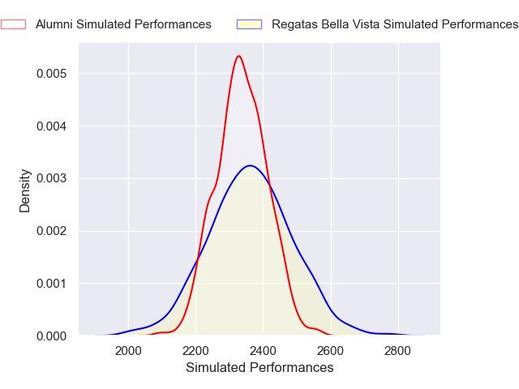
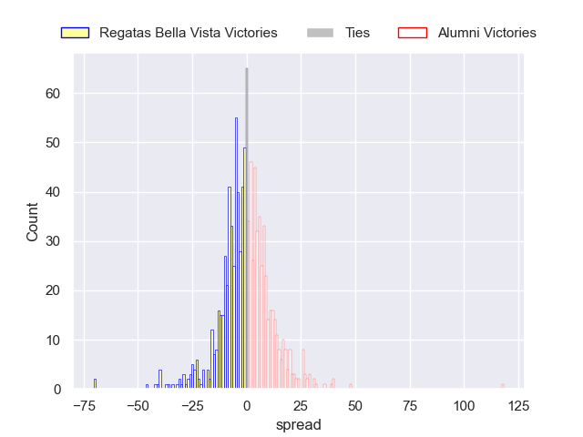

---  
layout: page  
title: Regatas Bella Vista V Alumni on 2025/09/27  
date: 2025-09-27  
categories: "URBA Top 13 2025" match projection  
---
# Regatas Bella Vista V Alumni on 2025/09/27, 16.0 to 15.0

# Club Level Predictions

Now that the game has been played, lets see how the club predictions did. I predicted Regatas Bella Vista to win by 2.38, and Regatas Bella Vista won by 1.0. That's an absolute error of 1.4 for the margin of victory, while my average absolute error has been 14.5 over the past six months. This prediction was more accurate than 93.4% of my recent predictions.

For the Over/Under model, I predicted a total of 50.5 and we have an actual total of 31.0. That's an absolute error of 19.5 compared to a six month average of 13.8. This prediction was more accurate than 25.6% of my recent predictions.
## Projected Performances - Club Model

## Projected Spreads - Club Model

## Projected Results - Club Model

