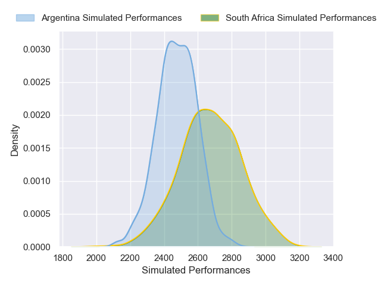
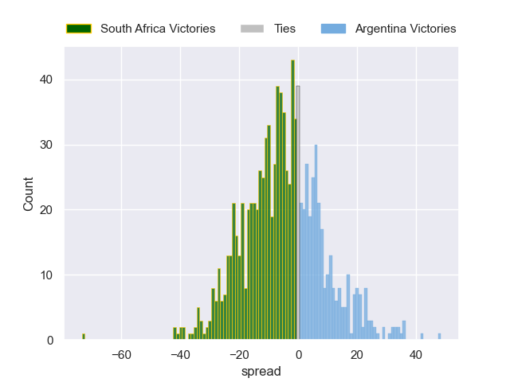

---  
layout: page  
title: South Africa V Argentina on 2025/09/27  
date: 2025-09-27  
categories: "Rugby Championship 2025" match projection  
---
# South Africa V Argentina on 2025/09/27, 67.0 to 30.0

# Club Level Predictions

Now that the game has been played, lets see how the club predictions did. I predicted South Africa to win by 5.22, and South Africa won by 37.0. That's an absolute error of 31.8 for the margin of victory, while my average absolute error has been 14.6 over the past six months. This prediction was more accurate than 8.4% of my recent predictions.

For the Over/Under model, I predicted a total of 51.5 and we have an actual total of 97.0. That's an absolute error of 45.5 compared to a six month average of 13.7. This prediction was more accurate than 1.9% of my recent predictions.
## Projected Performances - Club Model

## Projected Spreads - Club Model

## Projected Results - Club Model

